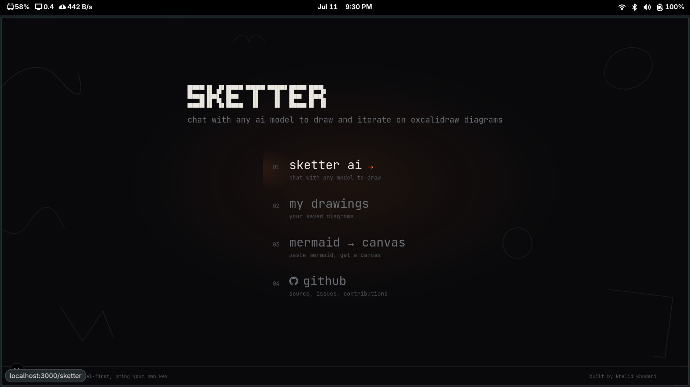
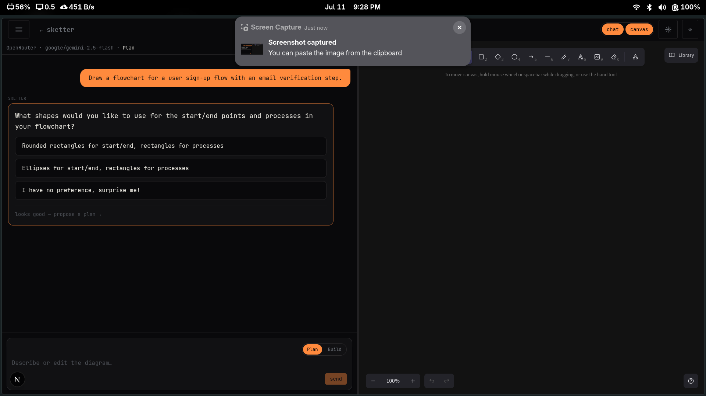
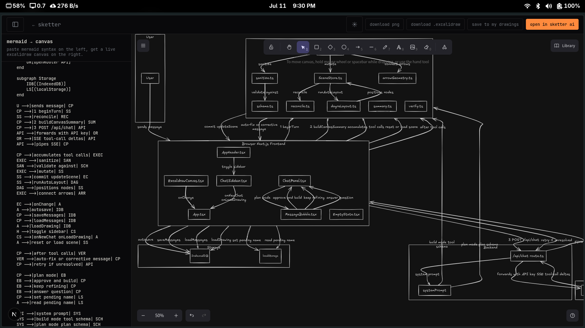
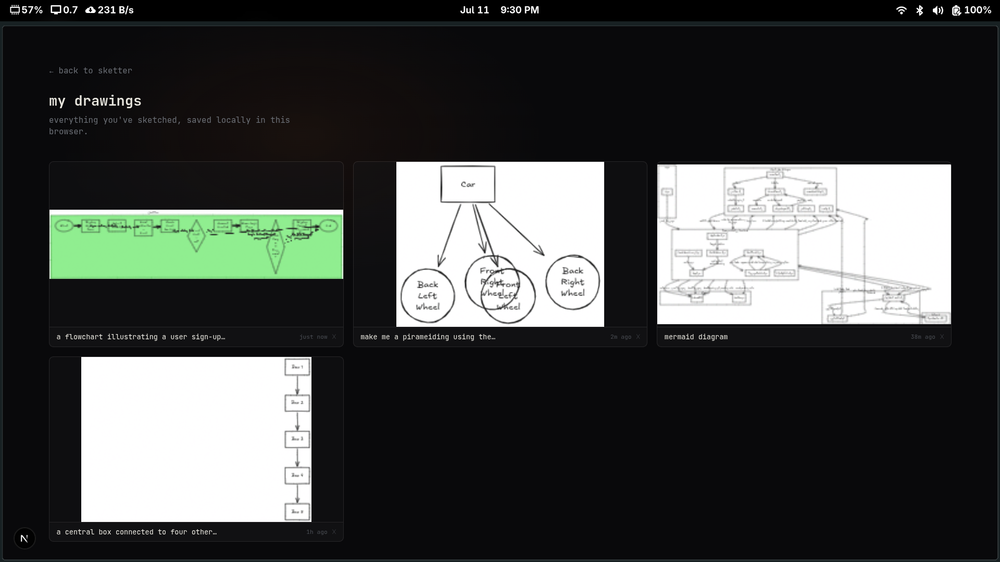

# Sketter

Chat with any AI model to draw and iterate on [Excalidraw](https://excalidraw.com) diagrams. No login, no backend database, bring your own [OpenRouter](https://openrouter.ai) API key.



## What it does

You describe a diagram, Sketter draws it on a real Excalidraw canvas, and you keep talking to refine it. It's not a chatbot that spits out a picture: the model calls a small set of tools (`add_node`, `connect`, `move_relative`, `update_element`, `import_mermaid`, ...) and each call gets applied to the live canvas as it streams in, so you watch the diagram build incrementally rather than waiting for one frozen dump at the end.

A few things it actually does well:

- **Plan mode.** Before it draws anything, it can ask you a couple of clarifying questions (shapes, scope, style) and propose a structured plan you approve, instead of guessing and redrawing three times.

  

- **It doesn't fight your manual edits.** If you drag something around or draw on top of what the AI made, the next turn reconciles against whatever's actually on the canvas instead of overwriting your changes.
- **Auto-layout, not eyeballed coordinates.** Node positions come from [dagre](https://github.com/dagrejs/dagre), not the model guessing pixel values, which is the difference between a diagram that looks clean and one where everything overlaps.
- **Mermaid → canvas.** Paste Mermaid syntax and get a fully editable Excalidraw scene back (every shape/arrow/label is its own independent element, not a flattened image). Save it, open it in the AI chat to keep building on it, or export it as PNG/`.excalidraw`.

  

- **Everything's saved locally.** Every drawing autosaves to IndexedDB in your browser and shows up in "my drawings" with a thumbnail. No account, no server-side storage.

  

## Getting started

```bash
npm install
npm run dev
```

Open [http://localhost:3000](http://localhost:3000), drop in an [OpenRouter API key](https://openrouter.ai/keys) in settings, pick a model, and start describing a diagram.

## Privacy / how the key is handled

Your API key lives **only** in your browser's `localStorage`. It's sent per-request to `/api/chat`, which is a stateless streaming proxy on the edge: it forwards the request straight to OpenRouter and logs nothing. It's never written to disk, a database, or any server-side store. No accounts, no telemetry, no tracking of what you draw.

## How it's built

```
Browser (Next.js)
  ChatPanel  <-->  ExcalidrawCanvas
       |                 |
       v                 v
  Tool executor (src/lib/tools + src/lib/canvas)
       |
       v
  /api/chat, a stateless streaming proxy (edge runtime)
       |
       v
  OpenRouter
```

The model never sees or emits raw Excalidraw JSON. It only ever calls the fixed tool schema in [`src/lib/tools/schema.ts`](./src/lib/tools/schema.ts), which a client-side executor ([`src/lib/tools/executor.ts`](./src/lib/tools/executor.ts)) sanitizes and applies. Each turn, the model gets a compact scene summary (see [`src/lib/canvas/summary.ts`](./src/lib/canvas/summary.ts)) instead of the full canvas JSON, which is what keeps smaller/cheaper models usable. After a build turn, the resulting geometry gets verified and the model gets one corrective follow-up if something's malformed, see [`src/lib/canvas/verify.ts`](./src/lib/canvas/verify.ts).

It's built on top of things that already exist rather than reinventing them: [`@excalidraw/excalidraw`](https://github.com/excalidraw/excalidraw) for the canvas itself, [`@excalidraw/mermaid-to-excalidraw`](https://github.com/excalidraw/mermaid-to-excalidraw) for Mermaid import (patched, see `patches/`; it had a bug where subgraph diagrams silently degraded to flattened images), and OpenRouter as the one API in front of many models.

## Known gaps

This is a personal project, not a polished product. There's no test suite or CI yet, and only OpenRouter is wired up as a provider (direct OpenAI/Anthropic keys are stubbed in the settings UI but not implemented). If either of those would be useful to you, contributions are welcome.

## License

MIT, see [LICENSE](./LICENSE).
